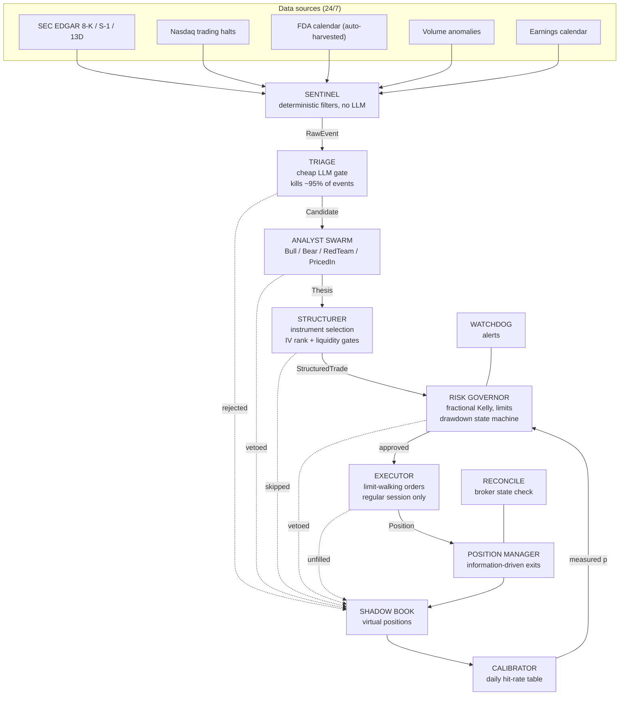
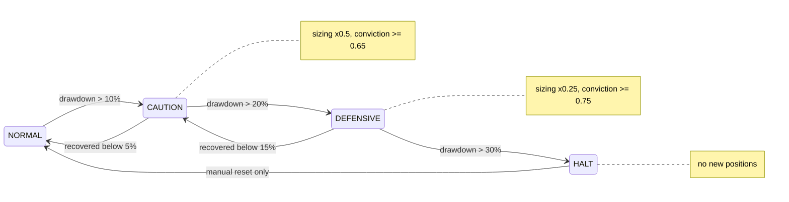
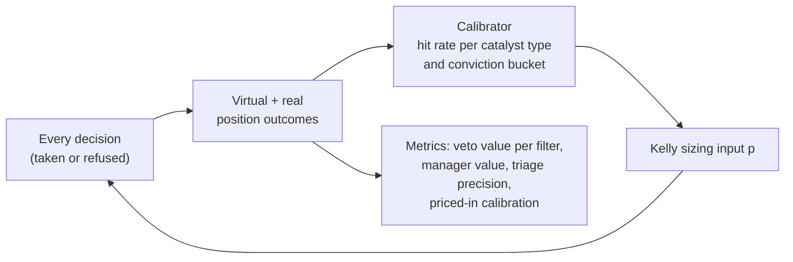

# Auriferous

An autonomous, event-driven trading system that hunts catalysts on US small/mid-cap equities and expresses theses primarily through options. Built around a multi-agent LLM analysis pipeline, deterministic risk management, and a self-calibrating learning loop.

---

## Disclaimer

**This system has never been run on a live account. Its real-world effectiveness is unknown and unproven.** All development so far has targeted paper trading. Historical or simulated behaviour is not indicative of future results.

**Nothing in this repository constitutes financial or investment advice.** This is a personal research project provided for educational purposes only. Trading involves substantial risk, including the loss of all invested capital. Options can expire worthless. If you run this software, you do so entirely at your own risk. The author accepts no responsibility or liability for any financial losses or other damages resulting from its use.

---

## Philosophy

The system is built on four principles:

1. **Event-driven, not clock-driven.** Positions exist because a catalyst exists. A position whose catalyst has expired is dead capital and gets closed.
2. **Convex payoffs.** Long options only (shorts expressed through puts, never borrowed stock): losses are capped at the premium, gains are uncapped. There is deliberately no take-profit: the right tail is where the returns live.
3. **Measured edge, not opinions.** Position sizing uses fractional Kelly fed by the system's own measured hit rates, never by an LLM's confidence. Until enough data exists, sizing stays deliberately conservative.
4. **Measure everything, including refusals.** Every rejected decision is tracked as a virtual position. The system knows what its filters cost, and its kill criteria are written down in advance.

The system does not try to win the speed race. Its pipeline latency (minutes) makes it uncompetitive on widely-watched breaking news, so it deliberately targets three slow games: under-followed filings on stocks with no analyst coverage, scheduled events analysed in advance (FDA decision dates, earnings), and post-event drift. A dedicated agent with veto power guards against entering trades the market has already priced.

## Architecture



### Pipeline stages

| Stage                    | LLM         | Role                                                                                                                                                                                                                                                                           |
| ------------------------ | ----------- | ------------------------------------------------------------------------------------------------------------------------------------------------------------------------------------------------------------------------------------------------------------------------------ |
| Sentinel                 | none        | Polls EDGAR filings, Nasdaq halts, an auto-harvested FDA (PDUFA) calendar, volume anomalies and earnings dates every 30 s. Deduplicates and prioritises.                                                                                                                       |
| Triage                   | cheap model | One structured call per event: is this an actionable catalyst with an expected move of at least 8%? Hard daily/hourly budgets.                                                                                                                                                 |
| Analyst Swarm            | main model  | Bull and Bear build opposing theses (each with an explicit key assumption). RedTeam's only job is to kill the trade. PricedIn scores how much of the move has already happened, from deterministic market inputs, and holds veto power. Synthesis is pure arithmetic, no LLM.  |
| Structurer               | none        | Picks the instrument from IV rank: cheap volatility buys raw premium, expensive volatility buys a debit spread, extreme volatility skips. Hard liquidity gates (spread <= 12%, open interest, volume, premium cap). Stock fallback for niche catalysts without liquid options. |
| Risk Governor            | none        | The only component that sizes positions: quarter-Kelly on measured hit rates (halved further while unmeasured), correlation limits per ticker/sector/catalyst type, total premium cap, drawdown ladder.                                                                        |
| Executor                 | none        | Limit orders only, walked from mid toward the market one tick per 15 s, never past the ask. Partial fills accepted at actual size. Commissions recorded into P&L.                                                                                                              |
| Position Manager         | none        | Exits on information: invalidated thesis, contrary event, elapsed horizon, theta decay, premium stop at -60%. Scales out half at +100% and lets the rest ride. Hard rule: no option lives closer than 2 trading days to expiry.                                                |
| Shadow Book + Calibrator | none        | Every refusal becomes a virtual position; a parallel book tracks each real trade unmanaged. Daily calibration turns outcomes into the hit rates that feed Kelly.                                                                                                               |

### Risk management: drawdown state machine

Equity is computed synthetically (initial capital + realised P&L + open position marks), never taken from the broker's paper balance. Drawdown from the high-water mark drives a sticky state machine with hysteresis:



Two additional circuit breakers block all new positions until manually resolved: a failed close before option expiry, and a position mismatch against the broker detected by the reconcile loop.

### The learning loop



This is the component that separates the system from an opinion generator. Filters that reject profitable trades show up as positive veto value; a strategy without edge shows up as negative calibrated edge; both trigger predefined responses, up to killing the project (see Validation).

## Requirements

- Python 3.10+
- Interactive Brokers account with IB Gateway (paper: port 4002)
- IBKR market data subscriptions: US Securities Snapshot Bundle and OPRA (US options); without OPRA the structurer cannot build option contracts
- OpenAI API key
- PostgreSQL (or SQLite via config)

## Setup

```bash
git clone https://github.com/galileo680/Auriferous.git
cd Auriferous
python -m venv venv
venv/Scripts/pip install -r requirements.txt
```

Create `config/.env` (see `config/.env.example`):

```
OPENAI_API_KEY=...
DB_USER=...
DB_PASSWORD=...
ALERT_WEBHOOK_URL=...          # optional: Discord/Slack webhook for alerts
```

Review `config/auriferous.yaml`: capital, broker port, budgets, risk limits. All thresholds are documented in `other/auriferous-implemetacja.md` (full implementation specification, in Polish).

## Running

First run:

```bash
venv/Scripts/python scripts/init_db.py
venv/Scripts/python scripts/refresh_universe.py
venv/Scripts/python scripts/refresh_pdufa.py
venv/Scripts/python scripts/preflight.py
venv/Scripts/python scripts/run.py
```

`preflight.py` is a go/no-go checklist: universe freshness, FDA calendar, database, broker connectivity, paper/live account consistency, unresolved critical errors. `run.py` starts the scheduler with all loops; everything from data refresh to exits is automated from that point.

### Operational scripts

| Script                                             | Purpose                                                                         |
| -------------------------------------------------- | ------------------------------------------------------------------------------- |
| `scripts/run.py`                                   | Main entry point, starts all scheduled loops                                    |
| `scripts/preflight.py`                             | Pre-start go/no-go checklist                                                    |
| `scripts/report.py`                                | Read-only status report: equity, positions, P&L, LLM costs, shadow book metrics |
| `scripts/validate.py`                              | Automated verdict on the validation criteria and kill criteria                  |
| `scripts/migrate_schema.py`                        | Adds missing database columns after upgrades (non-destructive)                  |
| `scripts/reset_halt.py`                            | Manual reset of the HALT drawdown state (rebases the high-water mark)           |
| `scripts/resolve_errors.py`                        | Clears critical blocking errors after manual review                             |
| `scripts/refresh_universe.py` / `refresh_pdufa.py` | Manual data refresh (also run weekly by the scheduler)                          |

## Validation protocol

The system considers itself validated only by numbers, on criteria fixed in advance:

**Stage 1 (paper, 8 weeks):** at least 60 closed decisions (real + virtual), triage precision >= 25%, RedTeam veto value <= 0 (the filter does not discard profitable trades), negative correlation between the priced-in score and subsequent moves, zero entries while in HALT, zero unresolved reconcile mismatches.

**Stage 2 (live, minimal capital):** starts at a small fraction of capital purely to measure real fill quality; scaling up requires 30 live trades with average slippage <= 8% versus mid.

**Kill criteria** (any of these ends the project): drawdown > 40%, calibrated edge < 0 after 100 decisions, positive veto value across all filter origins, LLM cost above 15% of capital per year.

## Project structure

```
src/
  core/         config, scheduler, market clock (NYSE sessions, algorithmic holidays)
  broker/       IBKR client: stocks, options, futures, order fills, margin checks
  database/     SQLAlchemy models, repository pattern
  sentinel/     event sources, dedup, universe
  triage/       cheap-LLM gate with budgets
  swarm/        Bull / Bear / RedTeam / PricedIn agents, deterministic synthesis
  structurer/   instrument decision table, IV rank, liquidity gates, contract building
  risk/         Kelly sizing, drawdown state machine, governor, LLM budget
  executor/     limit-walking execution engine, order lifecycle
  positions/    exit rules, position manager, broker reconciliation
  shadow/       shadow book, parallel book, calibrator, metrics
  alerts/       alert service and watchdog
scripts/        operational entry points (see table above)
tests/          377 tests (pytest)
```

## Testing

```bash
venv/Scripts/python -m pytest tests
```

The suite covers the decision table, Kelly math, drawdown hysteresis, the limit-walking engine, exit rules, shadow book accounting, calibration, and the validation criteria: 377 tests, no broker or API keys required.

## Status

A planned next features are: historical event studies on EDGAR data, insider-cluster signals, post-earnings drift playbook
